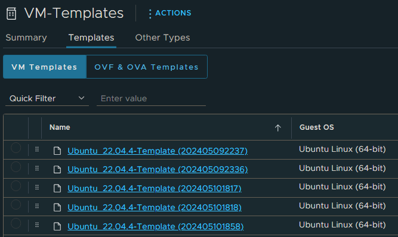

# helper-cls-cleanup

This is a small helper written python to clean up VM templates in vSphere Content Library. It re-uses the same CI
variables packer accepts, including the same service account to perform actions. Designed to be run as part of the
packer pipeline using the docker image.

The cleanup is supposed to identify redundant VM templates in the content library and remove them. The cleanup is based
on the following criteria: VM template name and the creation date. It will retain the newest one.

## Requirements

1. Run this docker container with below environment variables set.
2. The service account should have the necessary permissions to retrieve information and delete VM templates from the
   content library.
3. The names of the VM templates should be unique. If the names are not unique, the cleanup script will not work as
   expected. The name needs to be in the format of: `<name> (<unique value>)`. It uses the unique value `<unique value>`
   to uniquely identify the VM template and group templates based on `<name>`.

   Example:

   

## Environment variables

It requires below environment variables to be set.

These values are CASE-SENSITIVE! Match them precisely as shown below.

| ENV-Variable                     | Required | Default | Usage                                                  |
|----------------------------------|----------|---------|--------------------------------------------------------|
| PKR_VAR_vsphere_endpoint         | Yes      | None    | vCenter Hostname                                       |
| PKR_VAR_vsphere_username         | Yes      | None    | vCenter Account Username (should be a service account) |
| PKR_VAR_vsphere_password         | Yes      | None    | vCenter Account Password                               |
| PKR_VAR_vsphere_content_library  | Yes      | None    | Name of the Content Library to clean up                |
| CLEANUP_SCRIPT_TEMPLATES_TO_KEEP | No       | 1       | How many templates to keep                             |
| CLEANUP_SCRIPT_INSECURE_API      | No       | True    | Allow self-signed certs when connecting to vCenter API |
| CLEANUP_SCRIPT_DEBUG             | No       | False   | Enable debug logging                                   |
| CLEANUP_SCRIPT_DRY_RUN           | No       | False   | Enable dry-run. Sends no deletion requests.            |
